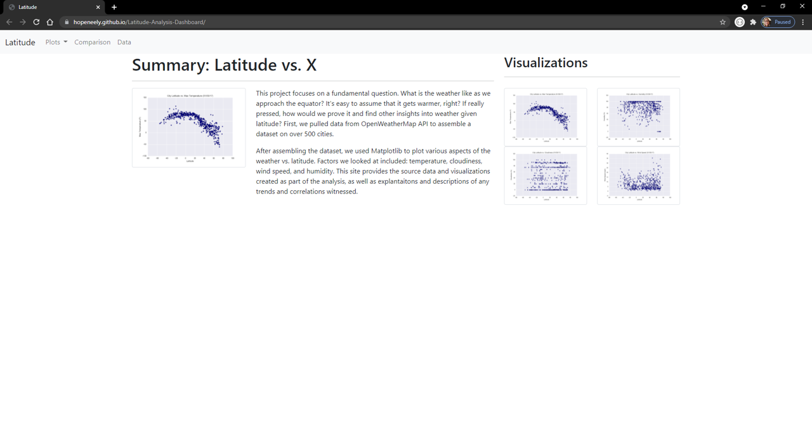
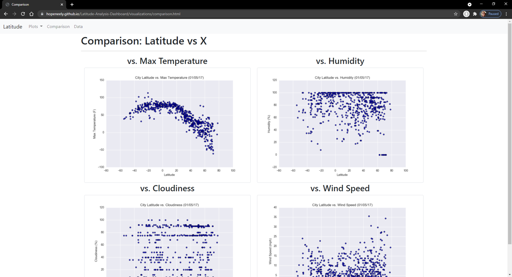
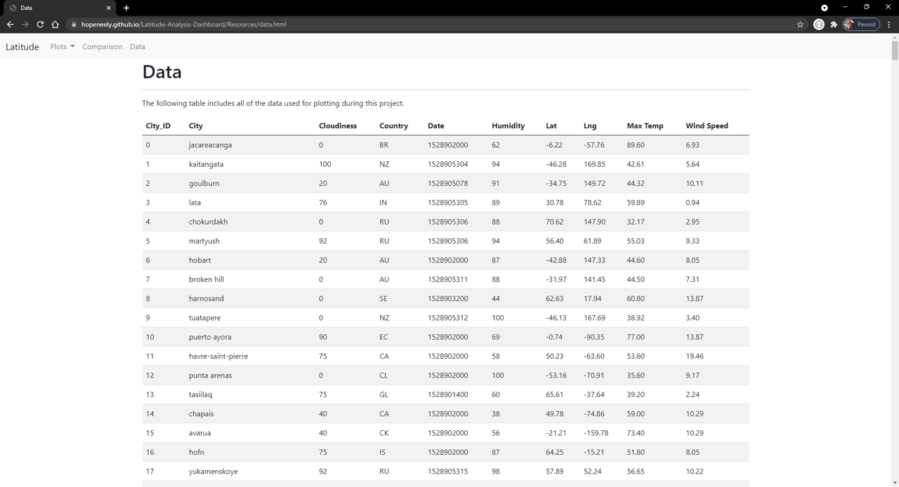

# Latitude Analysis Dashboard

This website dashboard displays information on weather in relation to distance from the equator. The landing page includes the project summary with links to individual plot pages, a comparison page, and a data page. The individual plot pages show a larger image of the plot with a summary of its findings. The comparison page shows the plots displayed next to each other with links to each individual page. The data page contains a data table with weather information on cities from around the globe. Check out the deployed Latitude Analysis Dashboard [here](https://hopeneely.github.io/Web-Design-Challenge/index.html).

## Data Sources:

 [Weather Data](Resources/cities.csv)

## Tools:

Python 
Jupyter Notebook 
HTML5/Bootstrap

# Process

HTML5 and Bootstrap were used to create the website consisting of 7 pages.
* Landing page contains:
  * An explanation of the project.
  * Links to each visualizations page. There should be a sidebar containing preview images of each plot, and clicking an image should take the user to that visualization. 
  
* 4 visualization pages, each with:
  * A descriptive title and heading tag.
  * The plot/visualization itself for the selected comparison.
  * A paragraph describing the plot and its significance. 
  
* Comparisons page with:
  * All of the visualizations on the same page so we can easily visually compare them.
  * A Bootstrap grid for the visualizations. 
  
* Data page with:
  * A responsive Bootstrap table containing the data used in the visualizations. 
  

Python and Jupyter Notebook were used to convert csv file into html table data. Then it was simply copied into the data.html file.  

# Contact Information
### Hope Neely 
Email: [hope.neely@gmail.com](hope.neely@gmail.com) 
LinkedIn: [https://www.linkedin.com/in/hopeneely/](https://www.linkedin.com/in/hopeneely/)

